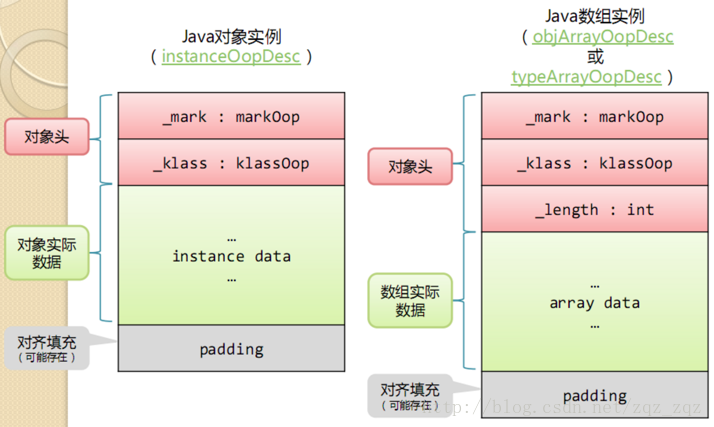

# java面试

## 对象结构

HotSpot虚拟机的对象头包括两部分信息：

* markword 

第一部分markword,用于存储对象自身的运行时数据，如哈希码（HashCode）、GC分代年龄、锁状态标志、线程持有的锁、偏向线程ID、偏向时间戳等，这部分数据的长度在32位和64位的虚拟机（未开启压缩指针）中分别为32bit和64bit，官方称它为“MarkWord”。

* klass 

对象头的另外一部分是klass类型指针，即对象指向它的类元数据的指针，虚拟机通过这个指针来确定这个对象是哪个类的实例.

* 数组长度（只有数组对象有） 

如果对象是一个数组, 那在对象头中还必须有一块数据用于记录数组长度.

[点击查看原文](https://blog.csdn.net/zqz_zqz/article/details/70246212)

